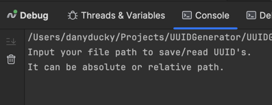
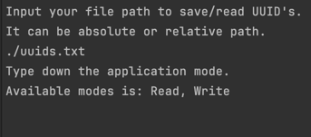
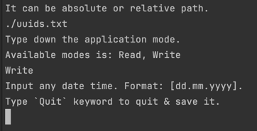
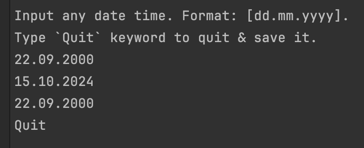
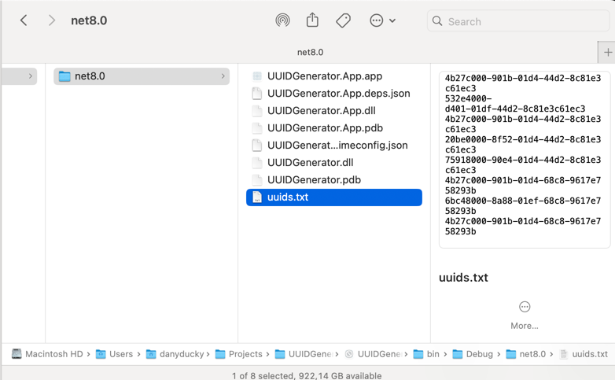
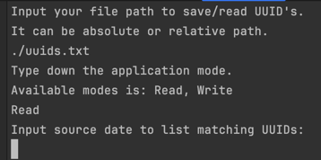
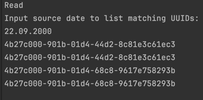
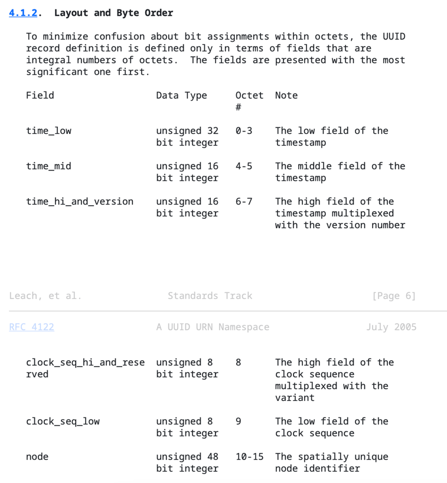

Инструкция по использованию:

Билдим и запускаем UUIDGenerator.App [ConsoleApp]

Далее увидим такой текст:

Введем путь к файлу (приложение само его создаст, если его нет).

Например, я ввожу: `./uuids.txt`

Далее будет предложено выбрать один из вариантов работы приложения: на чтение или запись.

Выберем на запись `Write` mode.

Далее мы должны ввести даты в формате `dd.mm.yyyy`, на основе них будут сгенерированы идентификаторы.

Я ввожу несколько дат и пишу `Quit`.

Можем увидеть файл, который был создан и заполнен по указанному пути.

Далее перезапускаем приложение и переходим в режим чтения `Read`.

Приложение просит ввести дату, что бы вывести отсортированные идентификаторы из файла.

PS. Мой файл содержит много сгенерированных идентификатор, результат может отличаться.

ВОПРОС 2:

Как мы можем увидеть в приложении - это реализовано. Смотрим файлы `Uuid.cs` и `UuidUtils.cs`.

Об этом можно прочитать в спецификации, https://datatracker.ietf.org/doc/html/rfc4122#section-4.1.2

Здесь можно увидеть под какими индексами мы храним и 
сколько бит выделяем под ту или иную часть данных внутри идентификатора.

`Учтите, что записи происходят очень часто и находятся на критическом пути, в то время как чтения достаточно редки (не реализовывайте все, просто опишите).`

Данный шаг в задаче описан не точно, возможно здесь подразумевается многопоточность, но я не стал так усложнять приложение.